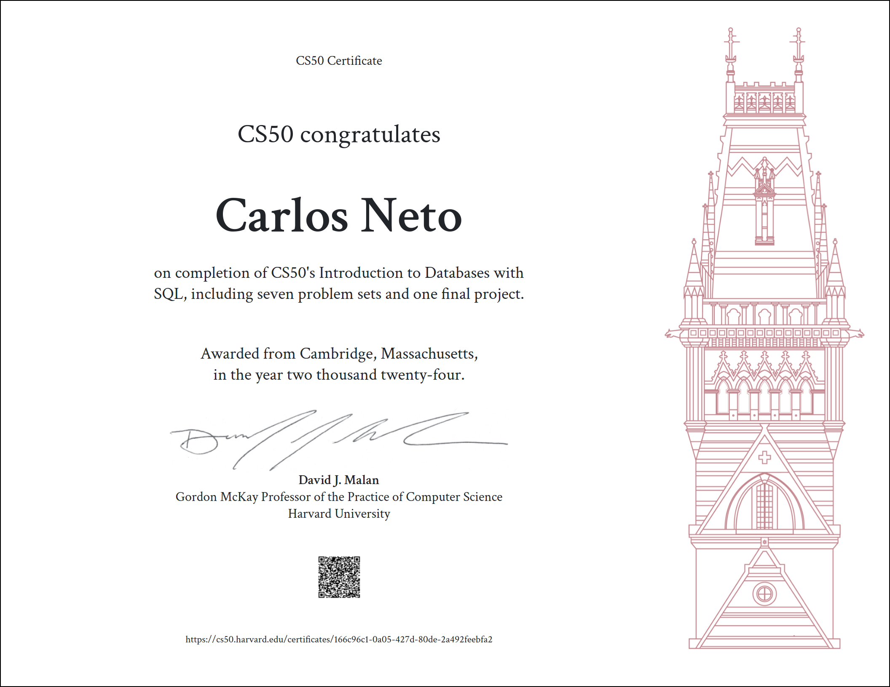

# CS50’s Introduction to Databases with SQL

Before reading the files in this repository, please remember the [Academic Honesty](https://cs50.harvard.edu/r/2023/honesty/).\
These files serve to give you a sense of how to solve the problems **if** you feel lost.\
Do not copy and paste any of these files. Try to solve the problems yourself!

## Submissions

* **[Querying](week0)**
   - [36 Views](week0/views)
   - [Cyberchase](week0/cyberchase)
   - [Players](week0/players)

* **[Relating](week1)**
   - [DESE](week1/dese)
   - [Moneyball](week1/moneyball)
   - [Packages](week1/packages)

* **[Designing](week2)**
   - [ATL](week2/atl)
   - [Happy to Connect](week2/connect)
   - [Union Square Donuts](week2/donuts)

* **[Writing](week3)**
   - [Don't Panic!](week3/dont-panic)
   - [Meteore Cleaning](week3/meteorites)

* **[Viewing](week4)**
   - [Bed and Breakfast](week4/bnb)
   - [Census Taker](week4/census)
   - [The Private Eye](week4/private)

* **[Optimizing](week5)**
   - [In a Snap](week5/snap)
   - [your.harvard](week5/harvard)

* **[Scaling](week6)**
   - [Dont't Panic! (Sentimental)](week6/dont-panic-python)
   - [From the Deep](week6/deep)
   - [Happy to Connect (Sentimental)](week6/sentimental-connect)

## Final Project

* **[Utae](project)**

## Certificate

