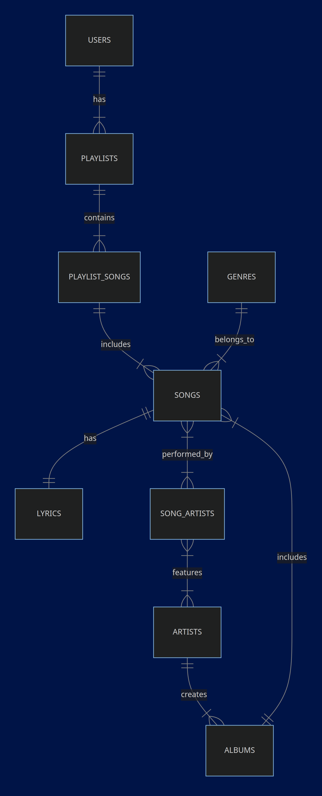

# Utae

By Carlos Neto, from Manaus, Brazil

Git: aka1Neto

Edx: ue_genio

Recorded on 19/05

Video overview: <[URL HERE](https://youtu.be/-ajT77PqHDI)>

## Scope

* **Purpose:** The purpose of this database is to store information about music, artists, albums, songs, and user playlists. The database allows users to create playlists, add songs to playlists, and discover new musics.
* **In Scope:** 
    * **Entities:** Artists, Albums, Songs, Genres, Users, Playlists
    * **Information:** Artist biographies, album release dates, song titles, lyrics, genre classifications, user accounts, playlist names, and song relationships with playlists.
* **Out of Scope:**
    * **Streaming Functionality:**  The database does not handle actual music streaming or file storage.
    * **User Profiles:** While users are represented, the database does not store detailed user profiles (like listening history, personal preferences, or social interactions). 
    * **Real-time Updates:** The database does not focus on real-time updates for streaming data like currently playing songs or live user activity. 

## Functional Requirements

* **User Abilities:**
    * Create a user account.
    * Create and name playlists.
    * Add songs to playlists.
    * Search for artists, albums, and songs.
    * View song lyrics.
    * Discover songs based on genre.
    * View details about artists and albums.
* **Beyond Scope:** 
    * The database does not support collaborative playlists or social features for sharing playlists with friends.
    * The database does not allow users to upload their own music or edit existing data.

### Representation

## Entities

**Artists:**

* `id` (Primary Key)
* `name`
* `biography` 

**Albums:**

* `id` (Primary Key)
* `title`
* `release_date`
* `artist_id` (Foreign Key referencing Artists)

**Genres:**

* `id` (Primary Key)
* `genre`

**Songs:**

* `id` (Primary Key)
* `title`
* `genre_id` (Foreign Key referencing Genres)
* `album_id` (Foreign Key referencing Albums)

**Song_Artists:**

* `song_id` (Foreign Key referencing Songs)
* `artist_id` (Foreign Key referencing Artists)
* Primary Key: (`song_id`, `artist_id`) 

**Lyrics:**

* `id` (Primary Key)
* `song_id` (Foreign Key referencing Songs)
* `lyric`

**Users:**

* `id` (Primary Key)
* `username`
* `password`

**Playlists:**

* `id` (Primary Key)
* `user_id` (Foreign Key referencing Users)
* `name` 

**Playlist_Songs:**

* `playlist_id` (Foreign Key referencing Playlists)
* `song_id` (Foreign Key referencing Songs)
* Primary Key: (`playlist_id`, `song_id`)

### Relationships
Entity Relationship Diagram (EDR)

## Optimizations

**Indexes:**

* **Artist, Album, Song, Genre, and User Lookups:** Created indexes on `name` (artists), `title` (albums & songs), `genre` (genres), and `username` (users) to speed up searches based on these fields.
* **Relationships between Entities:** Added indexes on `song_id`, `artist_id`, `playlist_id`, `song_id`, `album_id`, and `genre_id` in the respective join tables (`song_artists`, `playlist_songs`, `songs`, `albums`) to optimize lookups of associated entities.
* **User-Specific Data:** Indexes on `user_id` in `playlists` and `playlist_songs` are created to efficiently retrieve playlists and songs belonging to a specific user. 

**Views:**

* **`user_playlists_view`:** Provides a single query for accessing user and playlist data together. This simplifies queries and improves readability.
* **`playlist_songs_view`:**  Combines playlist information with its songs. This eliminates redundant joins, making queries more efficient.

**Procedure:**

* **`create_liked_songs_playlist()`:**  Automatically creates a "Liked Songs" playlist for every new user. This ensures data consistency and automates a crucial task.

## Limitations
* **No User Preferences or Ratings:** The database lacks mechanisms for storing user preferences or ratings. This prevents the implementation of personalized recommendations and social features

* **No Song Duration or File Size Information:** The database doesn't include information like song duration or file size. This data can be important for music players, streaming services, or for managing storage space.